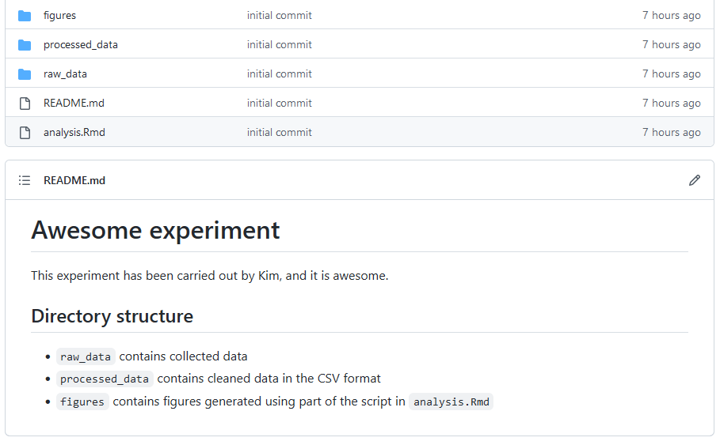
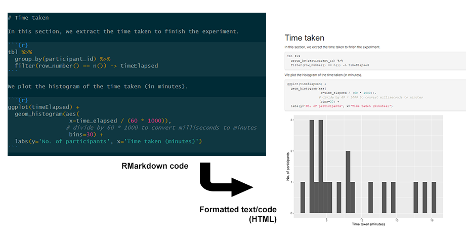

# Reproducible Workflow
{: .no_toc }
*Created by Ponrawee Prasertsom*

<details open markdown="block">
  <summary>
    Table of contents
  </summary>
  {: .text-delta }
1. TOC
{:toc}
</details>

## Introduction

A reproducible workflow is the practice of structuring your research process to ensure reproducibility. Here we specifically mean computational reproducibility: given your data files, analysis scripts and other relevant information, an interested party can easily reproduce the results you have achieved, including figures, tables, descriptive and inferential statistical measures.

This guide introduces ways that makes your workflow more reproducible, project structuring, documentation, and tooling: Git, and RMarkdown, for which a guide will be written soon.

<details markdown="block">
<summary>More</summary>
Reproducible workflow does require you to put more effort in organising data and analyses, but this extra effort is usually minimal and worthwhile. The key thing is to realise that the "interested party" who wants to reproduce the results is most often yourself. [This video](https://www.youtube.com/watch?v=s3JldKoA0zw) nicely illustrates this point. The message is that you sometimes have to redo your analysis from the start, e.g. if you discover that there is an error in your data or data processing code. 
In the worst case, this means going through the process from converting the data into the right format, feeding them to your statistical models to producing tables and figures all over again. 
Without the right setup, this could be a nightmare as you have to recall all your steps, but with a reproducible workflow it could be as simple as a couple of clicks.
</details>

## Project structure

The first step to creating a reproducible workflow is to organise your files around the steps you are likely to take. 
Virtually every scientific workfow consists of three steps: data acquisition, data processing and data analysis. 
You start with your initial, unprocessed raw data (*data acquisition*), then change them into a format appropriate for visualisation and statistical modelling (*data processing*). Finally, you might visualise your data and perform statistical analyses (*data analysis*). 

You will want to keep your project self-contained and have every file relevant to your analysis in one directory (or folder). The directory structure will track the three-step process above. Suppose your raw data are in `raw_data.csv` and your analysis script is `analysis.Rmd`, you can create directory structure that looks like the following:

```
|-- awesome_experiment
|   |-- raw_data
|   |   |-- raw_data.csv
|   |-- processed_data
|   |-- figures
|   |-- analysis.Rmd
```

This structure keeps the raw data and anything derived from it separate. As their names suggest, `raw_data` store your raw data, `processed_data` stores data after they have been processed or cleaned. 
Because mistakes could be made at any step, having separate directories for data at different stages helps prevent a disaster such as erroneously overwriting the original data with faulty processed data.

<details markdown="block">
<summary>More</summary>
There is nothing set in stone about this structure. Your analysis process may be more complicated, and the structure of your project should reflect that. 
For example, it may involve processing the data in several steps, in which case you may want to create new directories or subdirectories under `processed_data` to store the data after each processing step. 
You may also have results that are not figures, e.g. generated LaTeX tables, and you could create a separate directory for them.
</details>

### No space in your file/directory names
{: .no_toc}

One habit among tech-savvy people is to name files and directories without spaces. There are many reasons for this, but the one relevant to us is that, in Git (and [command line interfaces](https://en.wikipedia.org/wiki/Command-line_interface) in general), spaces are used to delimit between different parts of commands, and if file names contain spaces they have to be "escaped" using different strategies.
It is much simpler to make sure there are no spaces in file or directory names in the first place.
Simply use `_` or `-` in place of spaces.

## Documentation

Providing information about your data and analysis is an important part of reproducibility. Here, we consider two common ways you can achieve this.

### README files
README is the conventional name of any file that gives information about the directory or software. 
When we talk about metadata (``data that describes data''), README is part of it. 
In the context of reproducible workflow, the README file could describe, in different sections:

- What the important files and directories are: `figures` contains the generated plots, and `processed_data/processed_data.csv` contains the collected data after anonymisation, and so on
- Steps to reproduce: The list of steps to produce your results (e.g., statistics and figures), from installing the required software to the script(s) to run
- The structure of the data: The meaning of each column of your primary data file. For example, you might have a column called `logRT` for `log-transformed reaction time`, and `response` for the button that in your experiment, etc. This section 
- Other information you think might be relevant for the reproducer

If your project is small, you can provide all information in a single README file that lives in the root of your project (the main directory). 
If it is bigger, e.g., if you have multiple sub-experiments, you may want to create different README files for different experiments, and one README file that lives in the main directory that gives an overview.

Your README could be a text file (`README.txt`), but if you host your project on [Github](), its is a good idea to use (see [this tutorial](https://docs.github.com/en/get-started/writing-on-github/getting-started-with-writing-and-formatting-on-github/basic-writing-and-formatting-syntax) to start). 
On Github, the file named `README.md` will be automatically rendered when the user navigates to the directory that contains it. For example, if you have a `README.md` file that contains the following:

```
# Awesome experiment

This experiment has been carried out by Kim, and it is awesome.

## Directories and files

- `analysis.Rmd` is the main analysis script. It includes scripts for statistical modelling as well as plotting.
- `raw_data` contains collected data
- `processed_data` contains cleaned data in the CSV format
- `figures` contains figures generated using part of the script in `analysis.Rmd`
```

and your directory structure is as follows:

```
|-- awesome_experiment
|   |-- raw_data
|   |   |-- raw_data.csv
|   |-- processed_data
|   |   |-- processed_data.csv
|   |-- figures
|   |-- analysis.Rmd
|   |-- README.md
```

The main Github page (the page for the directory `awesome_experiment`) will look something like the following



### Code comments

As with any other project involving code, your analysis script should be properly commented.
In R, anything written after `#` will be taken as comments and not be evaluated as R code.
Your code should not simply be a paraphrase of what the code *means*, but should describe what the code is *for* when the code is complex, as well as document your decisions that are not immediately clear.
Thus, your comment should not be of the kind `X <- 5 # assign 5 to X`.
Rather, it should be of the kind `# create anonymised data from the raw data`, placed at the start of the code that replaces real names with participant IDs. 

In addition to this, particularly useful are comments that tell you why you choose specific values for some parameters. 
For example, you might comment that you set `maxfun` to `20000` because it helps the model converge in regression fitting: 

```
model <- lmer(response ~ condition + (1|partcipant),
		data=data, 
		control=lmerControl(
			optCtrl=list(maxfun=20000)
			# 20000 is the minimal number required for convergence
		) 
	)
```

## Tooling

### Literate programming (RMarkdown)

While literate programming has [a technical and historical definition](https://en.wikipedia.org/wiki/Literate_programming), in practical terms it simply means the style of programming that mixes code documentation and computer code directly.
This is similar to commenting your code, but instead of focusing on writing the code and explaining it later, you focus on recording how you think about approaching the problem and writing code to solve it, often in separate chunks of code that track your thought process.

The modern incarnation of literate programming is computational notebooks such as [Jupyter Notebooks](https://jupyter.org/) for Python and R.
These allow you to write sectioned, formatted text with chunks of code in-between. 
Here, we recommend using RMarkdown notebooks in RStudio, which can be compiled into a webpage or other formats.
A more detailed guide will be written and linked from here soon.



### Version control (Git)

[GIT](https://git-scm.com) is a version control system. 
This means that it allows you to record changes to your files and directories at different points in time and manipulate them.
For example, you could switch between different revisions of your files and directories, or create branches that record different ``timeline'' of changes.
Crucially, Git allows you to synchronise the files on your computer and a remote server, such as on [Github](https://github.com), making it a good collaboration tools for a team of researchers who share the same files.

In terms of reproducibility, the obvious function of Git is to host your project files for others to download. 
But in addition to this, Git also enables you and other researchers to inspect, transparently, the history of your project.
At times, you might update your project to fix some errors (e.g., along with published errata).
Any change like this could be reflected in Git. 

You can get started with Git by reading [our guide for Github]().

## Advanced topics

While our guides certainly help with reproducibility, *guaranteeing* computational reproducibility is difficult. Even if all the data and code are well-documented, different machines may have different software versions that affect the results in unexpected ways. Solutions to this problem range from simple (but less effective) such as using the [renv](https://rstudio.github.io/renv/articles/renv.html) package to complex (but more reliable) such as using [Docker](https://docker.com). The former records the specific versions of the R packages you use in your project, and streamlines downloading/installing them on a new machine. The latter packages everything about your project, from the OS you use, the files and the software. You can follow the links provided here to learn more.

## Acknowledgement
Most of the content here is drawn from Kitzes, Turek and Deniz's book [*The Practice of Reproducible Research*](http://www.practicereproducibleresearch.org/), and Çetinkaya-Rundel's talk [*Improving your workflow for reproducible science*](https://www.youtube.com/watch?v=JA-vLsN-sic).