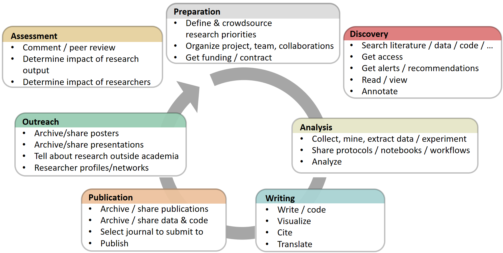

# PPLS Open Research
{: .fs-9 }

Welcome to this information hub for open research practices at the School of Philosophy, Psychology and Language Sciences.
{: .fs-6 .fw-300 }

[Getting started]({{ site.baseurl }}){: .btn .btn-primary .fs-5 .mb-4 .mb-md-0 .mr-2 } [Upcoming events](#upcoming-events){: .btn .fs-5 .mb-4 .mb-md-0 }

---

## What is Open Research

Open Research is transparent and accessible knowledge that is shared and developed through collaborative networks (Vicente-Sáez & Martínez-Fuentes 2018).

*Image source: https://open-science-training-handbook.gitbook.io/book/open-science-basics/open-concepts-and-principles*
{: .fs-2 .fw-300 }

[Read more]({{ site.baseurl }})

---

## Upcoming Events

- [(Oct 21st) Hands-on workshop on pre-registration]({{ site.baseurl }})
- [(Nov 4th) Hands-on workshop: introduction to Github]({{ site.baseurl }})
- [(Nov 18th) Hands-on workshop on sharing data]({{ site.baseurl }})

## Past Events

- [(Oct 7th) Introduction: what’s in it for me?]({{ site.baseurl }})

[See all events archive]({{ site.baseurl }})

---

## Contact

PPLSOpenResearch@ed.ac.uk
